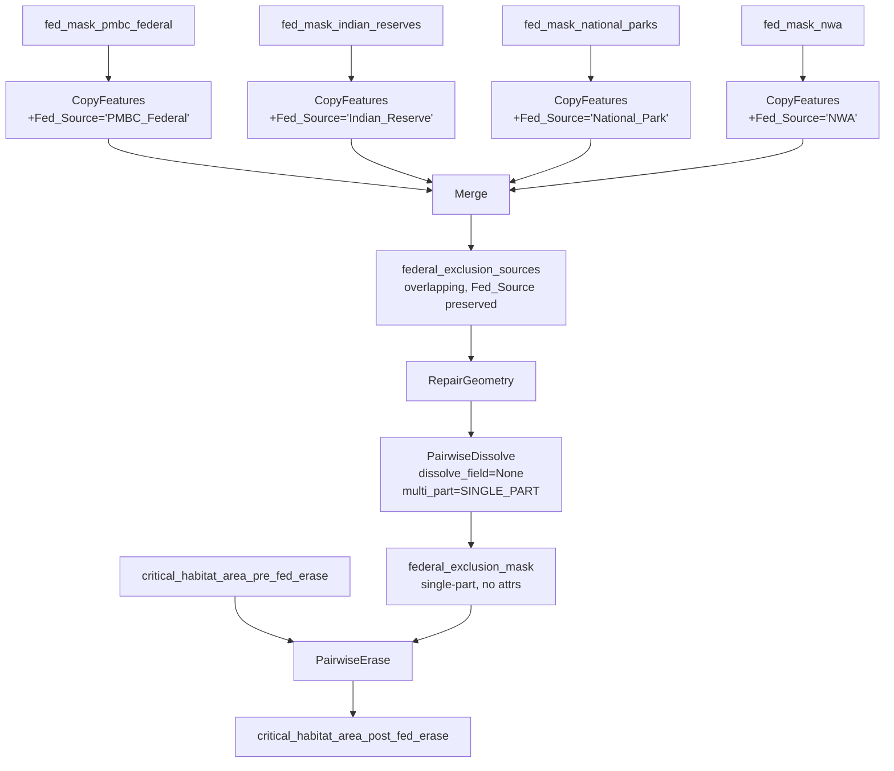

[](https://github.com/bcgov/repomountie/blob/master/doc/lifecycle-badges.md)[](https://opensource.org/licenses/Apache-2.0)


# Designated Lands — ArcGIS Pro Edition

Under section 63 of the *Species at Risk Act* (SARA), the Government of British Columbia must report every 180 days on the protection of Critical Habitat for listed species on non-federal lands. This pipeline supports that obligation for British Columbia by consolidating 40+ provincial land and marine designations into a single unified *Designated Lands* dataset using ArcGIS Pro and arcpy, and then intersecting the result with ECCC's **Critical Habitat Area Final (CHA)** polygons to quantify how much critical habitat is already covered by existing protections, with the option to add a date filter to find if there are any new protections implemented in the within the last date range. Each designation is categorized by the level of restriction it imposes on three industry sectors — forestry, oil & gas, and mining — at six levels: **Protected**, **Full**, **High**, **Medium**, **Low**, and **None**.

This is a re-implementation of the [original designatedlands tool](https://github.com/bcgov/designatedlands) (which used PostgreSQL/PostGIS), but extended in this script with CHA intersection, date-based change detection, and SARA reporting capabilities. This version replaces the database backend with Esri File Geodatabases and arcpy geoprocessing, making it runnable on any workstation with an ArcGIS Pro license. For more info on that dataset's methodology read [here](https://www.env.gov.bc.ca/soe/indicators/land/protected-lands-and-waters.html).

---

## Methodology

### Objective

This project serves two complementary objectives arising from Canada's **Species at Risk Act (SARA)** reporting obligations:

1. **Recurring 180-day report** — Under SARA section 63, the Government of Canada must report every 180 days on the protection of Critical Habitat for listed species. This pipeline produces a date-filtered analysis of newly established or modified designations within a reporting window, intersected with ECCC's Critical Habitat Area (CHA) polygons on non-federal land, quantifying changes in protection coverage since the last report.

2. **Long-term reusable dataset** — Beyond the recurring report, the pipeline produces a comprehensive, province-wide spatial dataset of overlapping land designation or planarized land designations as well as a dataset describing all existing protections that overlap with CHA.

### Data Compilation

Forty-two designation layers are compiled from two categories of sources:

- **BC Geographic Warehouse (BCGW)** — The majority of layers are downloaded programmatically from the province's public Web Feature Service (WFS) endpoint. Each layer is defined in `sources_designations.csv` with a BC Data Catalogue URL, an optional CQL query filter to select the relevant subset of features, and an optional date-filter template for change-detection workflows.
- **External / federal sources** — A small number of layers (National Parks, National Wildlife Areas, Migratory Bird Sanctuaries, Great Bear Rainforest schedules, Flathead watershed) are downloaded from federal or non-BCGW repositories and stored locally in `source_data/`. *Federal datasets are excluded by default but have an option to be included.

All source data is reprojected to NAD 1983 BC Environment Albers (EPSG:3005) and loaded into a working File Geodatabase. Per-source preprocessing (spatial clips, attribute-based dissolves) is applied where required, as defined in the CSV configuration.

### Priority System

Each designation is assigned a `process_order` — a positive integer that establishes its **priority** relative to all other designations. A **lower** `process_order` indicates **higher** priority. The ordering was carried over from the original Land Designations script and reflects the relative stringency and legal standing of each designation:

| Priority tier | process_order range | Examples |
|---------------|---------------------|----------|
| Highest | 1–6 | National Parks, Ecological Reserves, Provincial Parks, Conservancies, Protected Areas, Recreation Areas |
| High | 7–15 | Wildlife Management Areas, National Wildlife Areas, Mineral Reserves, Ungulate Winter Range (No Harvest) |
| Medium | 16–31 | Wildland Areas, Mining & Tourism Areas, Old Growth Management Areas, VQO Preserves/Retention, UWR/WHA Conditional Harvest |
| Low | 32–42 | VQO Partial Retention/Modify/Max Modify, Community Watersheds, Fisheries Sensitive Watersheds, Great Bear EBM Areas, Haida Gwaii EBM Areas |

This ordering is maintained in `sources_designations.csv` and is the primary mechanism for resolving spatial overlaps in the planarized output.

### Restriction Classification

Each designation carries a restriction rating for three resource industries: **forestry**, **oil & gas**, and **mining**, expressed on a six-level ordinal scale:

| Level | Integer code | Interpretation |
|-------|--------------|----------------|
| **Protected** | 5 | Fully protected from industrial activity by statute |
| **Full** | 4 | Full restriction — industrial activity prohibited under current management framework |
| **High** | 3 | High restriction — activity may be permitted under limited, tightly controlled conditions |
| **Medium** | 2 | Moderate restriction — activity generally requires special approval or conditions |
| **Low** | 1 | Low restriction — activity is broadly permissible with standard regulatory requirements |
| **None** | 0 | No restriction imposed by this designation |

The restriction values are maintained as text labels in `sources_designations.csv` and converted to integer codes at runtime.

#### Restriction Rating Methodology

The restriction ratings are derived from the land designation framework established by Environmental Reporting BC, which categorizes provincial land designations into three tiers based on what each designation's underlying legislation, regulation, or management plan actually permits or prohibits:

- **Protected Lands** — designations with the primary purpose of long-term conservation of nature and cultural values (e.g., Provincial Parks, Ecological Reserves, Conservancies)
- **Resource Exclusion Areas** — designations that fully exclude one or two resource activities for the purpose of conservation (e.g., no-harvest Wildlife Habitat Areas, no-harvest Ungulate Winter Ranges)
- **Spatially Managed Areas** — designations that manage or limit development or resource activity for conservation purposes, but where activity is still allowed to occur (e.g., conditional-harvest WHAs, Visual Quality Objectives, Old Growth Management Areas)

The 0–5 per-industry restriction scale (forestry, oil & gas, and mining) was established in the original [`bcgov/designatedlands`](https://github.com/bcgov/designatedlands) Python tool, which underpins the Environmental Reporting BC land designations indicator. This pipeline carries those ratings forward unchanged. For example:

- A **Provincial Park** receives Protected (5) for forestry, oil & gas, and mining because the *Park Act* prohibits industrial resource extraction across all sectors.
- A **no-harvest Wildlife Habitat Area** receives Full (4) for forestry because the *Forest and Range Practices Act* prohibits harvest within the WHA boundary, Medium (2) for oil & gas, and no restriction for mining because the WHA designation imposes no constraint on mineral exploration or development.
- A **conditional-harvest Ungulate Winter Range** receives Medium (2) for both forestry and oil & gas because activity is permitted under specified conditions rather than fully excluded, and no restriction for mining.

The ratings represent a structured interpretation of each designation's legal framework. Users should consult the underlying legislation and management plans for site-specific regulatory decisions.

> ¹ The original [`bcgov/designatedlands`](https://github.com/bcgov/designatedlands) Python script, including the restriction rating classifications and the `sources.csv` from which they are drawn, was created by Simon Norris at [Hillcrest Geo](https://hillcrestgeo.ca), Victoria, BC. See also the associated [Land Designations that Contribute to Conservation in B.C.](https://www.env.gov.bc.ca/soe/indicators/land/land-designations.html) indicator published by Environmental Reporting BC.

### Overlapping Output

The first analytical product, `designations_overlapping`, is produced by clipping each of the 42 designation layers to British Columbia's terrestrial boundary (`bc_boundary_land`) and inserting them into a single feature class. Overlaps between different designations are **preserved** — a single geographic area may carry attributes from multiple designation polygons stacked on top of each other. This output is suitable for queries such as *"list all designations that apply to this parcel."*

### Planarized Output

The second analytical product, `designations_planarized`, resolves all overlaps to produce a **non-overlapping (planar)** layer. 

This planarized version is the only one of the two outputs that can give you a defensible non-overlapping protection percentage per CHA polygon.

The method is:

1. **Union**: All polygons from `designations_overlapping` are passed through an ArcGIS `Union` operation. This splits every polygon at every intersection boundary, creating planar topology. Where *n* designations overlap, the Union produces *n* rows sharing geometrically identical polygon fragments — each row carrying the attributes of one contributing designation.

2. **Fragment grouping**: The Union fragments are grouped by spatial identity using a composite key of centroid coordinates (X and Y to 7 decimal places, ≈ 0.01 m precision in BC Albers), polygon area (2 decimal places), and polygon perimeter (2 decimal places). This key uniquely identifies each geometrically distinct fragment without modifying or simplifying the geometry — all original polygon boundaries from the Union are carried forward unchanged, preserving area accuracy.

3. **Priority resolution**: For each group of spatially identical fragments:
   - The **designation** is assigned from the fragment with the **lowest `process_order`** (highest priority). For example, where a Provincial Park (process_order 3) overlaps an Old Growth Management Area (process_order 19), the polygon is attributed as `park_provincial`.
   - The **restriction values** are set to the **maximum** across all overlapping designations for each industry, so the most restrictive rating always prevails. For example, if one overlapping designation has `forest_restriction = 3` (High) and another has `forest_restriction = 5` (Protected), the output polygon receives `forest_restriction_max = 5`.
   - An **`overlapping_designations`** field records the codes of **all** contributing designations as a semicolon-delimited string, sorted by `process_order` (e.g., `park_provincial; ogma_legal; vqo_retain`). This preserves the information about which designations were present before priority resolution collapsed them to a single attribution.

4. **Output generation**: The grouped results are written to the `designations_planarized` feature class using an `InsertCursor`, with a spatial index built for query performance.

The planarized output is non-overlapping — every point within a designated area is attributed to exactly one designation, making it suitable for area-based reporting, cartographic display, and industry-sector restriction mapping.

### Federal Exclusion and Federal Erase

The pipeline distinguishes two separate federal-land operations, each controlled by its own flag in `main.py`.

**1. `EXCLUDE_FEDERAL` — drops federal *designation layers* from the overlap/planarized outputs.**
Three of the 42 designation layers originate from federal jurisdiction (National Parks, National Wildlife Areas, Migratory Bird Sanctuaries). When `EXCLUDE_FEDERAL = True` (default) these layers are skipped entirely so the overlapping and planarized outputs reflect only provincial designations. The `jurisdiction` column in `sources_designations.csv` identifies the federal rows. `process_order` numbering is preserved regardless of the flag.

**2. `FEDERAL_ERASE` — removes federal *land* from the Critical Habitat polygons before the CHA × designation intersection.**
Under SARA s. 63, B.C. reports on the protection of Critical Habitat on **non-federal** land only. When `FEDERAL_ERASE = True` (default), `create_cha.py` builds a federal exclusion mask from four BCGW/ECCC sources (listed in `sources_supporting.csv` as `fed_mask_pmbc_federal`, `fed_mask_indian_reserves`, `fed_mask_national_parks`, `fed_mask_nwa`), merges and dissolves them to a single multipart polygon (`federal_exclusion_mask`), and uses `arcpy.analysis.PairwiseErase` to subtract that mask from the CHA. The raw CHA export is preserved as `critical_habitat_area_pre_fed_erase`; the erased copy becomes the authoritative `critical_habitat_area_post_fed_erase`. Any CHA polygon that is **entirely** on federal land is written to a separate `cha_fully_federal` feature class for audit and dropped from the overlap step.

The two flags are independent. `EXCLUDE_FEDERAL` affects what gets stacked into `designations_overlapping`; `FEDERAL_ERASE` affects the CHA denominator used by `intersect_area_calc.py`.

### Date-Based Change Detection

A date-filter mode restricts the analysis to designations established or modified within a specified time window, directly supporting the 180-day SARA reporting cycle. The filter is **off by default** and turns on whenever `START_DATE` is set to a non-empty ISO date in `main.py`'s PIPELINE OPTIONS block. Each source row in the CSV defines a `date_filter_query` template (e.g., `ESTABLISHMENT_DATE >= '{start_date}'`) that is injected into the WFS CQL filter at download time. Sources without a date-filterable attribute (noted as *"no date field available"* or *"non-BCGW source"*) are excluded from date-filtered runs. The date window is set using `START_DATE` and `END_DATE` in `main.py`. An xlsx report is generated on every run summarising the changes (when applicable), excluded layers, feature counts, warnings/errors, pipeline options used, and a non-spatial dump of the CHA intersect tables.

When the date filter is active, output feature class names are automatically suffixed with `_date_filter` (e.g., `designations_overlapping_date_filter`, `designations_planarized_date_filter`, `designations_planarized_date_filter_cha_03_20`) so that date-filtered outputs are immediately distinguishable from full-run outputs in the geodatabase. 

### Limitations

- **Restriction ratings are derived from the land designation framework established by Environmental Reporting BC** — they represent informed professional judgment based on policy review, not a legally authoritative determination. Users should consult the underlying legislation and management plans for site-specific decisions.
- **Temporal snapshot** — the dataset reflects the state of BCGW data at the time of download. Designations may have been added, modified, or removed since the last run.
- **Spatial precision** — the fragment-grouping method uses a composite key of centroid coordinates (X and Y to 7 decimal places, ≈ 0.01 m precision in BC Albers), polygon area (2 decimal places), and polygon perimeter (2 decimal places) to identify geometrically identical Union fragments. In extremely rare edge cases, two genuinely different polygons with nearly identical centroids, areas, and perimeters could theoretically be grouped together; however, this has not been observed in practice with the current source data.
- **Marine extent** — the analysis includes marine areas (marine ecosections and ABMS boundary) in the clipping boundary, so some designations may extend offshore. Users interested in terrestrial-only results should apply a post-processing clip to the land boundary.


---

## Geoprocessing Overview

### What the pipeline produces

The pipeline combines roughly 40 provincial designation layers (parks, conservancies, wildlife management areas, old-growth management areas, etc.) into **two output feature classes**, both projected in **BC Albers (EPSG:3005)**:

| Output | Description |
|--------|-------------|
| **designations_overlapping** | Every designation polygon clipped to BC's terrestrial boundary and stacked. Polygons from different sources can overlap — a single geographic area may carry attributes from multiple designations. |
| **designations_planarized** | A non-overlapping (planar) layer derived from the overlapping output. Where designations overlap, the polygon is assigned to the designation with the **lowest `process_order`** (highest priority). Union fragments are grouped for attribute resolution, and geometry is carried through unchanged. |

### Coordinate system

All processing is performed in **NAD 1983 BC Environment Albers (EPSG:3005)**, the standard provincial projection for BC government spatial analysis.

### Data sources

- **BC Geographic Warehouse (BCGW)**: Most designation layers are downloaded automatically via the province's public WFS endpoint (`https://openmaps.gov.bc.ca/geo/pub/wfs`). The pipeline resolves BC Data Catalogue URLs to WFS layer names and fetches GeoJSON features with optional CQL query filters.
- **Manual downloads**: A few sources (e.g., private conservation lands) are not available via WFS. These are placed in the `source_data/` folder and referenced from the CSV.
- **Critical Habitat Area**: The Critical Habitat Area dataset is sourced from ECCC's national Critical Habitat of Species at Risk in Canada data portal. The pipeline downloads `CriticalHabitat.zip` directly from the ECCC open data API at runtime, extracts it into a temporary sibling directory, validates the extracted geodatabase actually contains feature classes, and then automically moves it into `source_data/CriticalHabitat.gdb`. The geodatabase is stored under ONE canonical name (`CriticalHabitat.gdb`) for the lifetime of the project — there is no rename to a second filename. If the download fails, the pipeline falls back to an existing local `source_data/CriticalHabitat.gdb` only if it contains feature classes; stale empty geodatabases are rejected and removed. If neither succeeds, the pipeline raises an error with instructions to manually drop `CriticalHabitat.gdb` directly into `source_data/`.
Filtering
The national CHA dataset covers all of Canada and all species. The pipeline applies a definition query to filter to the relevant subset before exporting to a local feature class. The default filter applied is:
RD_Status IN (1) 
And ProvTerr_E LIKE '%British Columbia%'
And SciName NOT IN ('Taxidea taxus jeffersonii', 'Tyto alba', 'Pituophis catenifer deserticola',
    'Melanerpes lewis', 'Brachyramphus marmoratus', 'Accipiter gentilis laingi',
    'Chrysemys picta bellii', 'Sphyrapicus thyroideus', 'Rangifer tarandus',
    'Myotis septentrionalis', 'Antrozous pallidus')
And CommName_E NOT IN ('Woodland Caribou (Southern Mountain population)',
    'Woodland Caribou (Boreal population)')
This restricts the dataset to:

FINAL status (RD_Status = 1) — only legally finalized critical habitat designations, excluding proposed or interim polygons
British Columbia — features where the province/territory field includes British Columbia
Remove Wide Ranging Species — a defined list of wide-ranging species is excluded by default, as their critical habitat extends well beyond BC or overlaps complex jurisdictional boundaries that fall outside the scope of this analysis

The species exclusion list is controlled by the CHA_FILTER_OUT_WRS flag in main.py. When set to True, the full filter above is applied. When set to False, only the FINAL status and BC filters are applied and all species are included — useful for testing or when a full species coverage run is required.

**Output**
Before export, the pipeline stamps the original ECCC `OBJECTID` of each feature into a new attribute field called `CHA_Source_ID`. The filtered features are then exported to a new local feature class at `source_data/cha_exported.gdb/critical_habitat_area_pre_fed_erase` using FeatureClassToFeatureClass. The federal-erase step (see Appendix A) then produces `critical_habitat_area_post_fed_erase` as the authoritative CHA used downstream. Although ArcGIS reassigns OBJECTIDs sequentially during export, `CHA_Source_ID` survives as a regular field and flows through all subsequent intersection outputs. `CHA_Source_ID` can be joined directly to `OBJECTID` in the raw ECCC `CriticalHabitat.gdb` in `source_data/` to trace any output row back to the source national polygon.

### Federal exclusion

Three designation layers originate from federal jurisdiction:

| process_order | Designation |
|---------------|-------------|
| 1 | National Parks (Administered Lands) |
| 10 | National Wildlife Areas |
| 12 | Migratory Bird Sanctuaries |

By default these are **excluded** (`EXCLUDE_FEDERAL = True`) because this analysis focuses on provincially-managed lands. Set `EXCLUDE_FEDERAL = False` to include them.

### Restriction levels

Each designation carries restriction ratings for three resource industries (`forest_restriction`, `og_restriction`, `mine_restriction`). These values are **defined by the original land designations script maintained by ERBC** and  maintained as text labels in `sources_designations.csv` — each of the 42 source rows specifies a restriction level for forestry, oil & gas, and mining based on the policy or legislation governing that designation. At runtime, `designatedlands.py` converts the text labels to integer codes using a lookup dictionary defined in the `DesignatedLands.__init__()` constructor:

| Level | Code | Meaning |
|-------|------|---------|
| Protected | 5 | Fully protected from industrial activity |
| Full | 4 | Full restriction on the given industry |
| High | 3 | High restriction |
| Medium | 2 | Medium restriction |
| Low | 1 | Low restriction |
| None | 0 | No restriction |

No external GIS layer or database table defines these values — they originate entirely from the CSV and are encoded into the output feature class attributes during the `create_designations_overlapping()` step.

In the planarized output, where multiple designations overlap, the **maximum** restriction value for each industry is retained (highest restriction wins).


---

## Geoprocessing Workflow

The pipeline runs seven sequential steps. Each step builds on the outputs of the previous one.

```
┌─────────────────────────────────────────────────────────────────────┐
│  1. TEST CONNECTION   Verify working GDB is accessible             │
├─────────────────────────────────────────────────────────────────────┤
│  2. DOWNLOAD          Fetch each layer from BCGW WFS → GDB FCs    │
│                       (skip layers already present in GDB)         │
├─────────────────────────────────────────────────────────────────────┤
│  3. PREPROCESS        Clip / dissolve per-source as needed;        │
│                       merge land + marine → bc_boundary            │
├─────────────────────────────────────────────────────────────────────┤
│  4. PROCESS VECTOR    4a. designations_overlapping (clip & stack)  │
│                       4b. designations_planarized  (Union→Grouping)│
├─────────────────────────────────────────────────────────────────────┤
│  5. PROCESS RASTER    (Optional) PolygonToRaster → overlay TIFs   │
├─────────────────────────────────────────────────────────────────────┤
│  6. DUMP              Export FCs → output File Geodatabase          │
├─────────────────────────────────────────────────────────────────────┤
│  7. CLEANUP           Delete intermediate src_* / *_pp FCs         │
└─────────────────────────────────────────────────────────────────────┘
```

### Step 1 — Test Connection

Verifies the working File Geodatabase (`designatedlands.gdb`) is accessible and lists the feature classes currently in it. Catches connection problems before spending time on downloads.

### Step 2 — Download

For each source row in the CSV:

1. **Resolve** the BC Data Catalogue URL to a WFS layer name (e.g., `WHSE_TANTALIS.TA_PARK_ECORES_PA_SVW`).
2. **Fetch** features from the BCGW WFS endpoint as GeoJSON, applying any CQL query filter defined in the CSV.
3. **Convert** the GeoJSON to a feature class in the working GDB using `arcpy.conversion.JSONToFeatures`.
4. **Name** the feature class using the stable `process_order` value from the CSV (e.g., `src_02_park_er`), so that re-runs with different filter flags still match existing FCs and skip re-downloading.

For manual sources (`manual_download = T`), the data is loaded from local files in `source_data/` using `arcpy.conversion.FeatureClassToFeatureClass`.

Supporting layers (BCGS 1:20k tiles, BC boundary polygons, marine ecosections) are also downloaded here.

### Step 3 — Preprocess

Applies per-source preprocessing operations defined in the CSV:

- **Clip**: Clip a source FC by another FC (e.g., clip NGO conservation lands by `mk_boundary` to restrict to the Muskwa-Kechika Management Area).
- **Dissolve** (union): Dissolve overlapping features within a single source by specified attribute columns (e.g., dissolve multiple overlapping conservation land parcels by `CONSERVATION_LAND_TYPE`).

Preprocessed FCs are saved with a `_pp` suffix (e.g., `src_05_ngo_lands_pp`).

Also creates the **`bc_boundary`** feature class by merging:
- `bc_boundary_land` (provincial terrestrial boundary)
- Marine areas from `bc_abms` (BC Boundary ABMS) and `marine_ecosections`

The merged boundary is dissolved into a single polygon representing BC's full land and marine extent.

### Step 4 — Process Vector

**4a. `designations_overlapping`**

Creates an empty feature class with fields: `process_order`, `designation`, `source_id`, `source_name`, `forest_restriction`, `og_restriction`, `mine_restriction`. Then iterates each source in `process_order`:

1. Selects the preprocessed FC (if available) or the raw source FC.
2. **Clips** it to `bc_boundary_land` (land boundary) using `arcpy.analysis.Clip`.
3. Opens a `SearchCursor` on the clipped result and an `InsertCursor` on the output.
4. For each feature, inserts a row with the designation attributes and restriction levels looked up from the CSV configuration.

The result is a single FC where all designation polygons are stacked — overlaps between different designations are preserved.

**4b. `designations_planarized`**

Takes `designations_overlapping` and produces a non-overlapping output:


1. **Union** (`arcpy.analysis.Union`): Splits all polygons at every intersection boundary, creating planar topology. Every resulting polygon fragment knows which original designations it belonged to.
2. **Python-based spatial grouping**: Fragments are grouped by a composite key of centroid coordinates, area, and perimeter. For each group of spatially identical fragments:
   - The designation with the **lowest `process_order`** (highest priority) is assigned.
   - `forest_restriction_max`, `og_restriction_max`, and `mine_restriction_max` are set to the MAX across all contributing designations, ensuring the most restrictive level is reported for each sector.
   - All contributing designation names are collected into a semicolon-delimited `overlapping_designations` field.
3. Populates the output using `InsertCursor`, writing each unique planar polygon with its aggregated attributes. Each Union fragment retains its original geometry — polygons are not geometrically merged.

The result: The planarized output is non-overlapping — every point within a designated area is attributed to exactly one designation, making it suitable for area-based reporting, cartographic display, and industry-sector restriction mapping.

### Step 5 — Process Raster (Optional)

Requires the **Spatial Analyst** extension (not available with ArcGIS Pro Basic). Disabled by default (`RASTER = False`) and was not run in the 03_2026 edition of this script.

- **Rasterize**: Converts each designation source to a GeoTIFF at the configured resolution (default 100m) using `arcpy.conversion.PolygonToRaster`.
- **Overlay**: Uses NumPy array operations to combine all rasters into four outputs:
  - `designatedlands.tif` — designation codes (lowest process_order wins; highest priority)
  - `forest_restriction.tif` — forest restriction levels
  - `og_restriction.tif` — oil & gas restriction levels
  - `mine_restriction.tif` — mine restriction levels

### Step 6 — Dump

Exports `designations_overlapping` and `designations_planarized` from the working GDB into a clean output File Geodatabase at `outputs/designatedlands_output.gdb`. Creates the output GDB if it doesn't exist; overwrites existing FCs if they do.

### Step 7 — Cleanup

Deletes all intermediate feature classes (`src_*` and `*_pp`) from the working GDB to
reclaim disk space. The output GDB in `outputs/` is not affected.
Set `SKIP_CLEANUP = True` in `main.py` to retain intermediate data for debugging.

---

## Requirements

- **ArcGIS Pro** (tested with ArcGIS Pro 3.x)
- **ArcGIS Pro Basic** license (minimum) — Spatial Analyst extension needed only for raster processing
- **Python 3.9+** (via `arcgispro-py3` conda environment)
- **arcpy** (included with ArcGIS Pro)
- **openpyxl** 3.1.2+ (for xlsx report generation)
- Network access to `openmaps.gov.bc.ca` (BCGW WFS)


## Installation

1. Clone the repository:
    ```
    git clone https://github.com/cjsostad/designatedlands---AG.git
    cd "designatedlands - AG"
    ```

2. Activate the ArcGIS Pro Python environment:
    ```
    conda activate arcgispro-py3
    ```

3. Install openpyxl (if not already available):
    ```
    pip install openpyxl
    ```

4. If any data sources are marked `manual_download = T` in the source CSV, download those datasets to the `source_data/` folder.


## Usage

### Full pipeline (recommended)

Run the entire pipeline with default settings (no arguments required):

```
python main.py
```

This will:
- Exclude federal layers (National Parks, NWA, MBS)
- Apply the minimal CHA definition query (FINAL + BC only; all species included)
- Skip raster processing
- Download all layers, preprocess, build vector outputs, export, and clean up

### Main.py command-line options

```bash
# Use a specific config file
python main.py --config config_2020-10-08.cfg

# Verbose logging
python main.py --verbose

# Quiet logging
python main.py --quiet
```

For processing controls (date filter, federal exclusion, raster, skip download, skip cleanup, CHA filter), edit the `PIPELINE OPTIONS` block in `main.py`.

### All command-line flags

| Flag | Default | Description |
|------|---------|-------------|
| `--config`, `-c` | None | Path to `.cfg` configuration file |
| `--verbose`, `-v` | off | Increase log verbosity |
| `--quiet`, `-q` | off | Suppress log output |


## Pipeline Options

If you prefer, the top of `main.py` contains a block of hardcoded options that control the behaviour
of the entire pipeline. Edit these directly before running — no command-line flags are
needed.

```python
# =================================================================
# PIPELINE OPTIONS  —  Edit these directly, then hit Run in VS Code
# =================================================================
# START_DATE: "" (empty string) = no date filter (process full datasets).
#             "YYYY-MM-DD"      = filter active; only features
#                                 added/modified in the window are kept.
# END_DATE:   "" with a populated START_DATE defaults to today.
START_DATE         = "2025-04-01"   # Start of date window (YYYY-MM-DD) or "" for no filter
END_DATE           = "2026-04-01"   # End of date window (YYYY-MM-DD) or "" for today
EXCLUDE_FEDERAL    = True           # Exclude National Parks, NWAs, Migratory Bird Sanctuaries
FEDERAL_ERASE      = True           # Erase federal land from CHA before overlap analysis
SKIP_DOWNLOAD      = False          # True = skip WFS download (use existing data in GDB)
SKIP_CLEANUP       = False          # True = keep intermediate feature classes
RASTER             = False          # True = create raster outputs (requires Spatial Analyst)
CHA_FILTER_OUT_WRS = False          # True = full CHA filter (FINAL + BC + exclude species)
                                    # False = minimal CHA filter (FINAL + BC only)
# =================================================================
```

| Option | Type | Default | Description |
|--------|------|---------|-------------|
| `START_DATE` | str | `""` | The start of the date filter window, in `YYYY-MM-DD` format. **This is the single switch that turns the date filter on or off.** Leave as `""` (empty string) to process the full dataset with no date restriction. Set to a valid ISO date to enable date filtering — only designation features established or modified between `START_DATE` and `END_DATE` are downloaded and processed, and all output feature class names are suffixed with `_date_filter`. Each source in `sources_designations.csv` must have a `date_filter_query` entry for its features to be included in a date-filtered run — sources without a date-filterable field are excluded. Set this to the end date of the previous SARA 180-day report to capture all changes since the last submission. |
| `END_DATE` | str | `""` | The end of the date filter window, in `YYYY-MM-DD` format. Only used when `START_DATE` is set. When `START_DATE` is set and `END_DATE` is `""`, defaults to today's date at runtime. |
| `EXCLUDE_FEDERAL` | bool | `True` | When `True`, omits the three federal designation layers — National Parks (process_order 1), National Wildlife Areas (process_order 10), and Migratory Bird Sanctuaries (process_order 12) — from all pipeline steps. These layers originate from federal repositories with different update cycles and are excluded by default because the analysis focuses on provincially-managed lands. Set to `False` to include federal designations. |
| `FEDERAL_ERASE` | bool | `True` | When `True`, `create_cha.py` builds a federal land mask (PMBC federal parcels, Indian Reserves, National Parks, National Wildlife Areas) and runs `PairwiseErase` on the Critical Habitat polygons before the designation intersection. The resulting `critical_habitat_area_post_fed_erase` feature class carries a `Cha_Area_Fed_Removed` field (post-erase geodesic hectares) which becomes the denominator for `Pct_of_Cha_Prot_by_LandDes`. Any CHA polygon that is entirely federal is diverted to `cha_fully_federal`. Independent of `EXCLUDE_FEDERAL`. Set to `False` to retain the raw ECCC geometry (passthrough mode). |
| `SKIP_DOWNLOAD` | bool | `False` | When `True`, skips the WFS download step entirely and uses whatever `src_*` feature classes are already present in the working GDB (`designatedlands.gdb`). Useful when re-running processing steps after a completed download, or when testing changes to the vector processing logic without waiting for a fresh download. |
| `SKIP_CLEANUP` | bool | `False` | When `True`, retains all intermediate feature classes (`src_*` raw downloads and `*_pp` preprocessed versions) in the working GDB after the pipeline completes. Useful for inspecting intermediate outputs or debugging a processing issue. When `False`, these are deleted at Step 7 to reclaim disk space. |
| `RASTER` | bool | `False` | When `True`, runs the optional raster processing step (Step 5) after the vector outputs are complete. This converts designation polygons to four GeoTIFFs: `designatedlands.tif`, `forest_restriction.tif`, `og_restriction.tif`, and `mine_restriction.tif`. **Requires the ArcGIS Spatial Analyst extension** — the pipeline will fail at this step without it. Leave `False` if you only need vector outputs or do not have Spatial Analyst licensed. |
| `CHA_FILTER_OUT_WRS` | bool | `False` | Controls how broadly the Critical Habitat Area (CHA) dataset is filtered when downloaded from ECCC. When `True`, applies the full filter: FINAL status + British Columbia + excludes a defined list of wide-ranging species (e.g., Woodland Caribou, Grizzly Bear) whose critical habitat extends well beyond BC or overlaps complex jurisdictional boundaries. When `False`, applies only the FINAL status and BC filters — all species are included. Use `False` for standard SARA reporting runs; use `True` only when the wide-ranging species exclusions are appropriate for your analytical scope. |

### Re-running the pipeline with different settings

> ⚠️ **The pipeline does not detect when a toggle changed between runs.** Intermediate `src_*` and `*_pp` feature classes in `designatedlands.gdb` are silently reused if they already exist, regardless of the settings that produced them. Run [`pipeline_reset.py`](pipeline_reset.py) before your next `main.py` run whenever any of the following change:

| Toggle changed | Why a reset is needed |
|---|---|
| `START_DATE` / `END_DATE` set, cleared, or window shifted | `src_*` layers were downloaded with (or without) a date filter; re-running will reuse them instead of fetching the corrected set. |
| `EXCLUDE_FEDERAL` flipped `True` → `False` | Federal `src_*` layers are missing from the GDB and will stay missing unless a fresh download is forced. |
| `CHA_FILTER_OUT_WRS` flipped, while `SKIP_DOWNLOAD = True` | `create_cha.py` runs inside the download step; skipping the download means the CHA feature class keeps its previous WRS filter state. Either run the reset, or set `SKIP_DOWNLOAD = False` for that run so CHA is re-prepared. |
| `FEDERAL_ERASE` flipped, while `SKIP_DOWNLOAD = True` | The four `fed_mask_*` layers either weren't downloaded or weren't used last run; the CHA export still reflects the previous mode. Either reset or set `SKIP_DOWNLOAD = False` for that run. |
| Any edit to `sources_designations.csv` (query, preprocess op, priority) | The affected `src_*` and `*_pp` layers no longer match the CSV logic. |

**Safe re-runs (no reset needed):** rerunning with the same settings; toggling `SKIP_CLEANUP`, `RASTER`, `SKIP_VECTOR`, or the verbosity flags; re-running after `pipeline_reset.py` has just been run.

**Quick rule of thumb:** if you changed *what data goes in*, reset. If you only changed *what steps run* or *how outputs are named*, don't bother.

### Subcommand interface (Untested)

`designatedlands.py` also exposes individual pipeline steps as subcommands for advanced use:

```bash
python designatedlands.py download [CONFIG_FILE]
python designatedlands.py preprocess [CONFIG_FILE]
python designatedlands.py process-vector [CONFIG_FILE]
python designatedlands.py process-raster [CONFIG_FILE]
python designatedlands.py dump [CONFIG_FILE]
python designatedlands.py cleanup [CONFIG_FILE]
python designatedlands.py overlay IN_FILE OUT_FILE [CONFIG_FILE]
```

### Smart resume

`resume_pipeline.py` automatically detects which pipeline steps have already completed (by inspecting the GDB contents) and resumes from where the last run stopped:

```
python resume_pipeline.py
```


---

## Configuration

An INI-format `.cfg` file can be supplied via `--config`. Only include parameters you want to override — defaults are used for the rest.

See [`designatedlands_sample_config.cfg`](designatedlands_sample_config.cfg) for all available settings:

| Key | Default | Description |
|-----|---------|-------------|
| `dl_path` | `source_data` | Folder for downloaded source data |
| `sources_designations` | `sources_designations.csv` | Designation source definitions |
| `sources_supporting` | `sources_supporting.csv` | Supporting layer definitions |
| `out_path` | `outputs` | Output folder for final GDB and reports |
| `gdb_path` | `designatedlands.gdb` | Working File Geodatabase |
| `resolution` | `100` | Raster output resolution in metres |
| `n_processes` | `multiprocessing.cpu_count() - 1` | Parallel processes for raster overlay |


## Source CSV Files

### `sources_designations.csv`

Defines all 42 designation layers. Each row configures one data source. Key columns:

| Column | Description |
|--------|-------------|
| **process_order** | Integer defining overlay priority. Lower number = higher priority. |
| **exclude** | `T` to exclude the source from all operations. |
| **manual_download** | `T` if the source must be downloaded manually to `source_data/`. |
| **name** | Full name of the designation (e.g., "National Parks (Administered Lands)"). |
| **jurisdiction** | `federal` for federal sources; blank for provincial. Used by `EXCLUDE_FEDERAL` in `main.py`. |
| **designation** | Machine-readable underscore-separated code (e.g., `park_national`). |
| **source_id_col** | Column in the source data providing the unique feature ID. |
| **source_name_col** | Column providing the feature name. |
| **forest_restriction** | Restriction level for forestry: `Protected`, `Full`, `High`, `Medium`, `Low`, `None`. |
| **og_restriction** | Restriction level for oil & gas. |
| **mine_restriction** | Restriction level for mining. |
| **url** | BC Data Catalogue URL or direct download URL. |
| **bcgw_layer_name** | BCGW WFS layer name (if different from catalogue-resolved name). |
| **query** | CQL filter for WFS requests (e.g., `PARK_CLASS <> 'REC'`). |
| **date_filter_query** | CQL query with `{start_date}` / `{end_date}` placeholders used when the date filter is active (i.e., when `START_DATE` is set in `main.py`). |
| **preprocess_operation** | `clip` or `union` (dissolve). |
| **preprocess_args** | Arguments for preprocessing (clip boundary FC or dissolve columns). |

### `sources_supporting.csv`

Defines 11 supporting layers used during processing (not designation layers themselves):

- **BCGS 1:20k Grid** (`tiles_20k`) — tile index for parallel processing
- **NTS 250k Grid** (`tiles_250k`) — national topographic tile index
- **BC Boundary ABMS** (`bc_abms`) — administrative boundary (marine)
- **BC Boundary Land** (`bc_boundary_land`) — terrestrial boundary
- **Marine Ecosections** (`marine_ecosections`) — marine ecological zones
- **Muskwa-Kechika Boundary** (`mk_boundary`) — management area for clipping
- **Critical Habitat Area** (`critical_habitat_area`) — ECCC's Critical Habitat polygons (filtered to FINAL status, British Columbia, terrestrial species) used for the CHA intersection step
- **PMBC Federal Parcels** (`fed_mask_pmbc_federal`) — federal-owned parcels from the ParcelMap BC fabric; component of the federal-erase mask
- **Indian Reserves** (`fed_mask_indian_reserves`) — administrative boundaries of reserves; component of the federal-erase mask
- **National Parks (Admin Boundaries)** (`fed_mask_national_parks`) — Parks Canada administrative boundaries; component of the federal-erase mask
- **National Wildlife Areas** (`fed_mask_nwa`) — ECCC CPCAD 2025 NWA subset; component of the federal-erase mask


---

## Code Breakdown

### Project structure

```
├── main.py                          # Full pipeline runner (recommended entry point)
├── pipeline_reset.py                # Pre-run GDB cleanup utility — delete stale FCs before changing date filter settings (toggling START_DATE on/off or changing the date window)
├── designatedlands.py               # Core DesignatedLands class and geoprocessing logic
├── date_filter.py                   # Date-based filtering and xlsx report generation
├── create_cha.py                    # Download and prepare the CHA dataset from ECCC
├── intersect_area_calc.py           # CHA × designation intersection and area calculations
├── gdb_utils.py                     # File GDB validation/creation helpers used by pipeline
├── sources_designations.csv         # 42 designation source definitions
├── sources_supporting.csv           # 7 supporting layer definitions (incl. CHA)
├── designatedlands_sample_config.cfg  # Example configuration file
├── designatedlands.gdb/             # Working File Geodatabase (intermediate data)
├── source_data/                     # Downloaded / manual source data files
├── outputs/                         # Output GDB and reports
│   ├── designatedlands_output.gdb/  # Final clean output geodatabase
│   └── designated_lands_pipeline_report.xlsx  # Pipeline report
├── logs/                            # Timestamped run logs
├── rasters/                         # Raster outputs (when RASTER = True)
└── scripts/                         # Utility scripts
  └── utility_scripts/
    ├── Create_CHA_AOI.py        # Legacy/alternate CHA AOI preparation helper
    ├── find_schema.py           # Query BCGW WFS for date/time fields in source schemas
    ├── _test_all_cql.py         # Validate all CQL queries against WFS endpoints
    ├── resume_pipeline.py       # Smart resume with auto-detection of completed steps
    └── run_planarized.py        # Standalone planarized output runner
```

Script placement policy:
- Keep only core pipeline scripts in the repository root (`main.py`, `designatedlands.py`, `date_filter.py`, `create_cha.py`, `intersect_area_calc.py`, `gdb_utils.py`).
- Place testing, diagnostic, legacy, and one-off utilities under `scripts/utility_scripts/`.

### `main.py` — Pipeline Orchestrator

The recommended entry point. Parses command-line arguments, initialises the `DesignatedLands` object, and runs each pipeline step in sequence with error handling and progress output.

Key responsibilities:
- Prints a configuration banner showing active flags
- Calls `DesignatedLands()` constructor (loads CSVs, applies filters, sets up GDB)
- Wraps each step in `run_step()` which captures arcpy messages and logs failures
- Generates an xlsx report on every run, summarising changes, excluded layers, feature counts, pipeline options, and designation categories
- Controls optional steps ( eg. raster, cleanup) via the PIPELINE OPTIONS block in main.py
- Controls the CHA definition query scope via `CHA_FILTER_OUT_WRS` — when `False`, overrides the CSV query to include all species (FINAL + BC only)

### `designatedlands.py` — Core Processing Engine

Contains the `DesignatedLands` class with all geoprocessing methods:

| Method | Purpose |
|--------|---------|
| `__init__()` | Load config, read CSVs, filter sources, set up GDB and arcpy environment |
| `_read_sources()` | Parse CSV, validate process_order, apply federal exclusion & date filtering |
| `_validate_sources()` | Check that process_order starts at 1 and has no gaps or duplicates |
| `download()` | Fetch all sources from WFS or local files into the working GDB |
| `preprocess()` | Apply per-source clip/dissolve operations |
| `create_bc_boundary()` | Merge land + marine boundaries into single `bc_boundary` FC |
| `create_designations_overlapping()` | Clip each source to BC and stack into overlapping output |
| `create_designations_planarized()` | Union → spatial grouping/ranking → non-overlapping output |
| `rasterize()` | Convert vector designations to per-source GeoTIFFs |
| `overlay_rasters()` | Combine rasters using NumPy (lowest process_order wins; highest priority) |
| `dump()` | Export final FCs to `outputs/designatedlands_output.gdb` |
| `overlay()` | Intersect an external layer with `designations_overlapping` |
| `cleanup()` | Remove intermediate `src_*` and `*_pp` FCs from working GDB |
| `test_connection()` | Verify GDB accessibility |

The module also provides:
- **Automatic arcpy message logging**: All arcpy tool calls are wrapped to log geoprocessing messages at the appropriate level.
- **WFS download infrastructure**: Functions to resolve catalogue URLs, fetch GeoJSON via WFS, strip Z-coordinates, and load results into a GDB.
- **Raster attribute table creation**: `create_rat()` function for building `.tif.vat.dbf` files.

### `date_filter.py` — Reporting & Date Filtering

Provides date-based WFS queries and xlsx report generation using **openpyxl**:

- `apply_date_filter_to_query()` — Injects `{start_date}` and `{end_date}` into CQL query templates.
- `run_report()` — Queries WFS for recently changed features and generates a 5-sheet Excel workbook:
  - **Changes**: Features added/modified within the date window
  - **Excluded Layers**: Layers removed by date or federal filter
  - **Summary**: Feature counts per designation
  - **Pipeline Options**: Run settings, excluded federal layer list, and source query filters used for the current run
  - **Designation Categories**: Designation-to-category mapping used in the report
- `write_report_xlsx()` — Low-level workbook creation with formatted headers and auto-sized columns.

### `resume_pipeline.py` — Smart Resume

`detect_completed_steps()` inspects the working GDB to determine which pipeline steps have already been completed:

- Checks for `src_*` feature classes matching the expected source list
- Checks for `bc_boundary` existence
- Checks for `designations_overlapping` and `designations_planarized`
- Checks for FCs inside `outputs/designatedlands_output.gdb`
- Checks whether intermediate FCs have been cleaned up

Resumes from the first incomplete step, or can be overridden with `--force-from STEP`.

### `create_cha.py` — CHA Dataset Preparation and Federal Erase

Downloads the **Critical Habitat Area (CHA)** dataset from ECCC and (optionally) erases federal land from it before the designation overlap step.

**Download / filter / export:**
- Reads the CHA entry from `sources_supporting.csv` and downloads `CriticalHabitat.zip` with retry logic.
- Extracts into a temporary sibling directory, validates the extracted geodatabase actually contains feature classes, and atomically moves it to `source_data/CriticalHabitat.gdb` under one canonical name. Stale/empty fallback copies are rejected.
- Applies the definition query (FINAL + BC, plus the wide-ranging species exclusion when `CHA_FILTER_OUT_WRS = True`) and stamps the ECCC `OBJECTID` into `CHA_Source_ID` on the exported layer.
- Exports to `source_data/cha_exported.gdb/critical_habitat_area_pre_fed_erase` and renames the original ECCC area field from `Area_ha` to `ECCC_Cha_Area_Ha`.

**Federal erase (new, controlled by `apply_federal_erase` / `FEDERAL_ERASE`):**
- Looks up the four `fed_mask_*` layers in a mask GDB (default `designatedlands.gdb`) and validates each one exists, has >0 features, and sits in EPSG:3005. The NWA source is additionally checked against the raw NAD83 download in `source_data/`.
- Copies each mask layer, stamps a `Fed_Source` label, then `Merge` → `RepairGeometry` → `PairwiseDissolve(multi_part="SINGLE_PART")` to produce `federal_exclusion_mask`.
- Runs `PairwiseErase(critical_habitat_area_pre_fed_erase, federal_exclusion_mask, critical_habitat_area_post_fed_erase)` at the default XY tolerance (multipart kept) and adds `Cha_Area_Fed_Removed` (`AREA_GEODESIC HECTARES`).
- Audits the erase: asserts `CHA_Source_ID` uniqueness pre- and post-erase, computes the set difference of IDs, verifies `post_count == pre_count − len(fully_removed)`, writes any wholly-federal CHA polygons to `cha_fully_federal`, and logs Σ-area before/after plus delta.
- Requires an ArcGIS Pro **Standard** license (or higher) for `PairwiseErase` and **Advanced** for `PairwiseDissolve`; the module checks `arcpy.ProductInfo()` up front and raises a clear error if the license is insufficient.
- All geoprocessing is wrapped in `arcpy.EnvManager(outputCoordinateSystem=SpatialReference(3005))` so standalone CLI runs match pipeline runs.

Can be run standalone (`python create_cha.py --mask-gdb path/to/designatedlands.gdb` with an optional `--no-federal-erase` flag) or called from the pipeline via `prepare_cha(..., federal_mask_gdb=..., apply_federal_erase=...)`.

### `Create_CHA_AOI.py` — CHA with AOI Clip (Testing)

A testing variant of `create_cha.py` that adds an **Area of Interest (AOI)** clip. Filters the CHA dataset to a spatial extent for faster development iterations, producing a smaller feature class suitable for debugging the intersection workflow without processing the full provincial dataset.

### `intersect_area_calc.py` — CHA Intersection & Area Calculations

Performs the spatial intersection between designated lands and CHA, then quantifies protection coverage:

- `run_cha_intersection()` — Intersects both `designations_planarized` and `designations_overlapping` with the (post-erase) `critical_habitat_area_post_fed_erase` feature class.
- Validates up front that the CHA input carries `Cha_Area_Fed_Removed`; if missing (e.g., `SKIP_DOWNLOAD = True` reused a pre-federal-erase `cha_exported.gdb`) the step raises a `RuntimeError` with instructions to rerun with `SKIP_DOWNLOAD = False`.
- Adds `Overlap_Area_Ha` (geodesic hectares) to each intersect feature class.
- Adds `Pct_of_Cha_Prot_by_LandDes = safe_pct(Overlap_Area_Ha, Cha_Area_Fed_Removed) × 100` (capped at 100). The denominator is now the **post-erase** non-federal area, not the raw ECCC area.

Can be run standalone or imported as a module from the pipeline.

### `find_schema.py` — WFS Schema Inspector

Queries the BCGW WFS `DescribeFeatureType` endpoint for each layer referenced in the source CSVs and reports any fields whose XML schema type contains `date` or `time`. Used during initial configuration to identify which source layers support date-based filtering.

### `_test_all_cql.py` — CQL Query Validator

Validates every CQL query defined in the source CSVs against the live WFS endpoint:

1. Checks that all field names referenced in CQL filters exist in the WFS schema (via `DescribeFeatureType`).
2. Sends each CQL filter to the WFS endpoint and verifies it returns HTTP 200.

Run before production pipeline executions to catch broken or outdated CQL queries early.


---

## Vector Outputs

The `dump` step writes two feature classes to `outputs/designatedlands_output.gdb`:

> **Naming convention:** When the date filter is active (i.e., `START_DATE` is set in `main.py`), all output names are suffixed with `_date_filter` (e.g., `designations_overlapping_date_filter`, `designations_planarized_date_filter`). This ensures date-filtered outputs are immediately distinguishable from full-run outputs when both exist in the same geodatabase.

### `designations_overlapping`

- This is intermediate data and is basically Land Designations but slightly filtered (ie. possible date filter)

Each individual designation polygon, clipped to land boundary, with full attribution. Overlaps are preserved.

| Field | Description |
|-------|-------------|
| `process_order` | Priority rank from CSV |
| `designation` | Machine-readable designation code |
| `source_id` | Original feature ID from source data |
| `source_name` | Original feature name from source data |
| `forest_restriction` | Forestry restriction level (0–5) |
| `og_restriction` | Oil & gas restriction level (0–5) |
| `mine_restriction` | Mining restriction level (0–5) |
| `Total_Area_ha` | Area of polygon in hectares|
### `designations_planarized`

- Intermediate data similar to Land Designation Dataset
- source_id and source_name are populated from the highest-priority contributing source feature (lowest `process_order`)
- if multiple contributing features share the same winning `process_order`, tie-breaks are deterministic: prefer populated source fields, then lexicographically smallest `source_id` and `source_name`

Non-overlapping output. Where designations overlap, the polygon is assigned to the highest-priority designation. Restriction fields hold the maximum value across all overlapping designations. All contributing designation names are listed in `overlapping_designations`.

| Field | Description |
|-------|-------------|
| `process_order` | Priority rank from CSV |
| `designation` | Highest-priority designation code on 1 - 42 scale from .csv file (lowest `process_order`) |
| `overlapping_designations` | Semicolon-delimited list of all designation codes that overlap this polygon (e.g., `vqo_retain; fsw`), sorted by priority |
| `source_id` | Source feature ID from the winning (highest-priority) contributing designation feature |
| `source_name` | Source feature name from the winning (highest-priority) contributing designation feature. The specific attribute read is controlled by the `source_name_col` column in `sources_designations.csv` — it varies per source layer (e.g., `protected_lands_name` for BC Parks layers, `conservancy_area_name` for Conservancies, `site_name` for Wildlife Management Areas, `ENGLISH_NAME` for National Parks). The wide variety of values across rows reflects the diversity of naming fields in the underlying BCGW source data. |
| `forest_restriction_max` | Maximum forest restriction across overlapping designations |
| `mine_restriction_max` | Maximum mine restriction |
| `og_restriction_max` | Maximum oil & gas restriction |


## CHA Intersection Outputs

When the CHA (Critical Habitat Area) intersection step runs, it produces two intersect feature classes in the output geodatabase.

> **Naming convention:** CHA output names include a date stamp (`_MM_DD`). When the date filter is active, `_date_filter` is inserted before the `_cha` segment (e.g., `designations_planarized_date_filter_cha_03_20`).

### `designations_overlapping_cha[_MM_DD]`

Intersection of `designations_overlapping` with CHA. Overlaps between designation fragments are preserved, and each intersect fragment carries both designation attribution and CHA fields.

### `designations_planarized_cha[_MM_DD]`

Intersection of `designations_planarized` with CHA. Because planarized designations are non-overlapping, each intersect fragment represents the highest-priority designation assigned to that area.

### Per-feature `CHA_Protected_Pct`

The intersect feature classes (`designations_planarized_cha` and `designations_overlapping_cha`) each contain a `Pct_of_Cha_Prot_by_LandDes` field on every individual feature. This shows what fraction of the (post-federal-erase) CHA polygon is represented by that specific intersect fragment:

$$\text{Pct\_of\_Cha\_Prot\_by\_LandDes} = \frac{\text{Overlap\_Area\_Ha}}{\text{Cha\_Area\_Fed\_Removed}} \times 100$$

Where `Cha_Area_Fed_Removed` is the geodesic hectare count of the Critical Habitat polygon **after** federal land has been erased. If `FEDERAL_ERASE = False` was used, this field still exists (set equal to the raw ECCC area in passthrough mode) so downstream readers never need to switch denominators.

### How CHA polygons are fragmented

The original CHA polygons enter the pipeline as whole, unfragmented geometries from ECCC's national dataset. During the `PairwiseIntersect` step in `intersect_area_calc.py`, each CHA polygon is split into smaller fragments wherever it crosses a designation polygon boundary. For example in the **Planarized output**:

- **Input**: 1 CHA polygon (500 ha) overlapping 3 designation areas (provincial park, OGMA, wildlife habitat area).
- **After PairwiseIntersect**: 3 fragment rows (e.g., 180 ha + 220 ha + 100 ha = 500 ha total). Each fragment inherits:
  - `ECCC_Cha_Area_Ha = 500` — the **original** ECCC area, carried through as a reference attribute (unchanged).
  - `Cha_Area_Fed_Removed = <≤500>` — the post-erase geodesic area of the (possibly-trimmed) CHA polygon. Used as the denominator for `Pct_of_Cha_Prot_by_LandDes`.
  - `CHA_Source_ID` — the original ECCC `OBJECTID` of the CHA polygon, joinable directly to `CriticalHabitat.gdb/CriticalHabitatArea` on `OBJECTID`.
  - `Overlap_Area_Ha` — the fragment's actual geometry area (geodesic hectares).
  - `designation`, `process_order`, restriction fields from whichever designation the fragment falls within.
- **Per-fragment percentage**: `Pct_of_Cha_Prot_by_LandDes = Overlap_Area_Ha / Cha_Area_Fed_Removed × 100`.

No additional CHA summary tables are generated by the current pipeline; analysis should use the intersect feature classes directly.

**Federal-erase audit artefacts.** The `cha_exported.gdb` working geodatabase also contains `critical_habitat_area_pre_fed_erase` (the raw ECCC export, pre-erase), `federal_exclusion_sources` (merged mask inputs with a `Fed_Source` label), `federal_exclusion_mask` (dissolved multipart mask), and — when non-empty — `cha_fully_federal` (CHA polygons that were entirely consumed by the erase). These are not copied to `outputs/designatedlands_output.gdb` by default, but are available for QA.

### Backtracing to the CHA Polygon

Every output row can be traced directly back to the original ECCC national dataset using the `CHA_Source_ID` field.

`CHA_Source_ID` is the `OBJECTID` of the polygon in ECCC's `CriticalHabitat.gdb/CriticalHabitatArea` at the time of download. `create_cha.py` stamps this value into a regular attribute field before running `FeatureClassToFeatureClass` (which would otherwise discard it by reassigning OBJECTIDs sequentially). The field then flows through `PairwiseIntersect` into all intersection outputs.

To trace a row back to its source polygon, join `CHA_Source_ID` to `OBJECTID` in the ECCC download — no intermediate pipeline-exported copy is required.


### Example output contents (verified run: 2026-03-24; federal-erase step added October 2026 — a new run against the live BCGW/ECCC endpoints is required to re-verify output contents under the new flag)

For the run logged in `logs/designatedlands_20260324_192326.log` (date filter active, federal layers excluded), the output geodatabase `outputs/designatedlands_output.gdb` contained the following objects:

**Feature classes**

- `designations_overlapping_cha`
- `designations_overlapping_date_filter`
- `designations_overlapping_date_filter_cha_03_24`
- `designations_planarized_cha`
- `designations_planarized_date_filter`
- `designations_planarized_date_filter_cha_03_24`

This mixed set (base + `_date_filter` + date-stamped `_cha_MM_DD`) is expected when multiple runs write to the same output File GDB over time.


---

## Raster Outputs (Optional)

When `RASTER = True`, four GeoTIFFs are produced in `outputs/`:

1. `designatedlands.tif` — Designation codes (lowest process_order wins in overlaps; highest priority)
2. `forest_restriction.tif` — Forest restriction levels
3. `og_restriction.tif` — Oil & gas restriction levels
4. `mine_restriction.tif` — Mine restriction levels

Each raster includes an attribute table (`.tif.vat.dbf`).


---

## Appendix A — How the federal mask is built

The federal-erase steps live in [create_cha.py](create_cha.py) inside `_federal_erase_pipeline()`. It runs only when `apply_federal_erase=True` (default) and after `critical_habitat_area_pre_fed_erase` has been exported.

### Inputs — four federal-land sources

Read from `designatedlands.gdb` (populated by `DL.download()` from the four `fed_mask_*` rows in the `sources_supporting.csv`):

| FC name in `designatedlands.gdb` | `Fed_Source` label | Origin |
|---|---|---|
| `fed_mask_pmbc_federal` | `PMBC_Federal` | BCGW ParcelMap BC Parcel Fabric, filtered to `OWNER_TYPE = 'Federal'` |
| `fed_mask_indian_reserves` | `Indian_Reserve` | BCGW CLAB Indian Reserves (admin boundaries) |
| `fed_mask_national_parks` | `National_Park` | BCGW CLAB National Parks |
| `fed_mask_nwa` | `NWA` | ECCC CPCAD 2025 — NWA subset (zip download) |

**Validation on each input** (fails if any of the below checks fail):

- `arcpy.Exists(src_path)` — layer is in the GDB
- `GetCount > 0` — at least one feature (prevents silent under-erase)
- `sr.factoryCode == 3005` — BC Albers only 
- NWA extra: inspect the original ECCC download in `source_data/ProtectedConservedArea_2025.gdb`, confirm datum contains `North_American_1983` so NAD83 realisations aren't accidentally mixed with ITRF/WGS84.

### Build steps (all inside `cha_exported.gdb`)



1. **Stage copies** — each of the four `fed_mask_*` layers is copied into `cha_exported.gdb`using `CopyFeatures` as `_fed_mask_src_<label>` and stamped with a `Fed_Source` TEXT(32) field so the lineage of every polygon is traceable after the merge.
2. **Merge** → `federal_exclusion_sources`. One FC containing every input polygon, each row still carrying its `Fed_Source` label. This is the auditable feature class so you can find "which input contributed this federal polygon?"
3. **Clean up staged copies** — the four `_fed_mask_src_*` intermediates are deleted. On UNC file GDBs the delete can fail with "File read/write error" because `Merge` holds a schema lock on the inputs; the code calls `ClearWorkspaceCache` first and treats a residual delete failure as non-fatal (the whole `cha_exported.gdb` is recreated at the start of every `prepare_cha()` run, so orphans are wiped on the next run).
4. **RepairGeometry** on `federal_exclusion_sources` so self-intersecting rings don't break the dissolve.
5. **PairwiseDissolve** → creates the output called `federal_exclusion_mask`: `dissolve_field=None` and `multi_part="SINGLE_PART"`. Overlapping/adjacent federal polygons collapse to one row per discrete federal landmass, no attributes are carried through. This is the actual erase geometry. 
6. **PairwiseErase**: `critical_habitat_area_pre_fed_erase` erased by `federal_exclusion_mask` creates → `critical_habitat_area_post_fed_erase` (the authoritative CHA used by `intersect_area_calc.py`).
7. **Add `Cha_Area_Fed_Removed`** on the final FC via `CalculateGeometryAttributes AREA_GEODESIC HECTARES`. This is the post-erase non-federal area, used as the denominator for `Pct_of_Cha_Prot_by_LandDes`.
8. **Audit** (`_audit_federal_erase`): asserts `CHA_Source_ID` uniqueness pre- and post-erase, computes `set(pre_ids) − set(post_ids)` to find CHA polygons that were entirely consumed by the erase, verifies `post_count == pre_count − len(fully_removed)`, and emits Σ-area pre/post/delta to the log. If any CHA polygons were wholly removed, they are exported with their original attributes to `cha_fully_federal` for species-at-risk audit.

### Coordinate-system guarantees


- All geoprocessing is wrapped in `arcpy.EnvManager(outputCoordinateSystem=arcpy.SpatialReference(3005))`

### Edition stamp

The NWA mask uses CPCAD edition 2025 (`ProtectedConservedArea_2025.gdb` / `ProtectedConservedArea_2025` layer). The URL, filename, and layer name in `sources_supporting.csv` all carry the year and need an annual bump when CPCAD publishes a new release.

---

## License

    Copyright 2022 Province of British Columbia

    Licensed under the Apache License, Version 2.0 (the "License");
    you may not use this file except in compliance with the License.
    You may obtain a copy of the License at

       http://www.apache.org/licenses/LICENSE-2.0

    Unless required by applicable law or agreed to in writing, software
    distributed under the License is distributed on an "AS IS" BASIS,
    WITHOUT WARRANTIES OR CONDITIONS OF ANY KIND, either express or implied.
    See the License for the specific language governing permissions and
    limitations under the License.

This repository was originally posted and  maintained by [Environmental Reporting BC](http://www2.gov.bc.ca/gov/content?id=FF80E0B985F245CEA62808414D78C41B). Click [here](https://github.com/bcgov/designatedlands) for the original Designated Lands Repository. 

Click [here](https://github.com/cjsostad/designatedlands---AG) for the repository that contains the script described in this document.